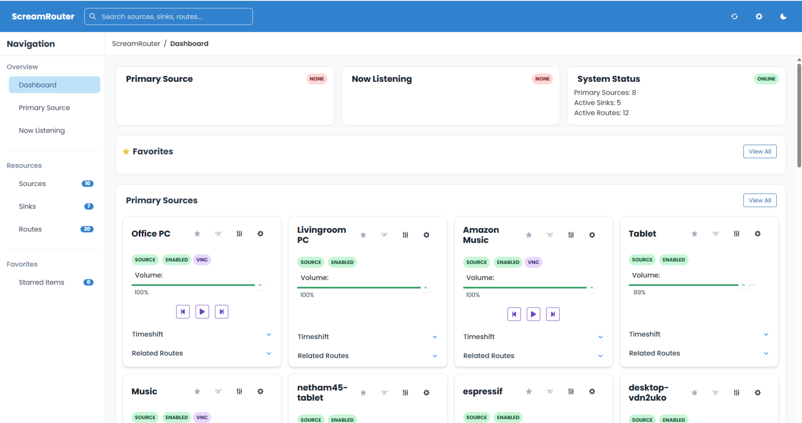

# ScreamRouter Documentation Site

This repository contains the documentation website for ScreamRouter, an audio streaming and routing solution.

## Important Note

This is only the website files. For the actual ScreamRouter documentation and downloads, please visit:

👉 **[https://screamrouter.net/](https://screamrouter.net/)**

## About ScreamRouter

ScreamRouter is an audio streaming and routing solution that allows for flexible audio management across devices. The documentation covers:

- Installation guides for Windows, Linux, ESP32, and Raspberry Pi
- Configuration instructions
- API documentation
- Integration with Home Assistant
- Docker setup
- Technical details and UI guides

## Documentation Site Development

This documentation site is built with React. To run it locally:

```bash
# Install dependencies
npm install

# Start development server
npm start
```

## Screenshots


